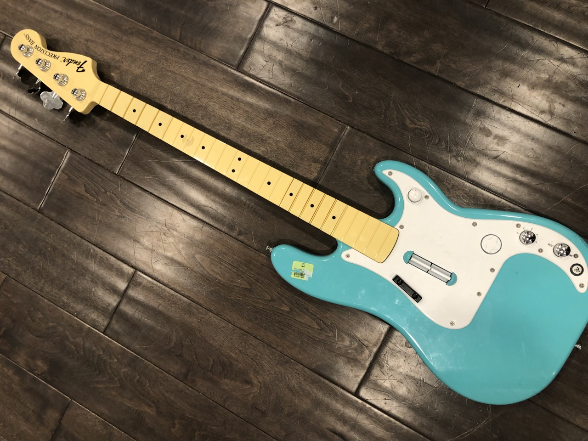
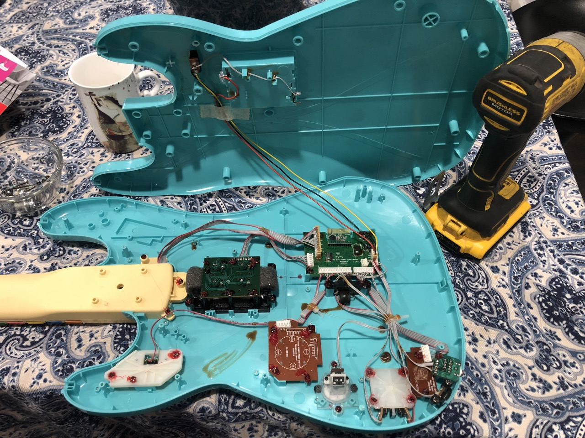
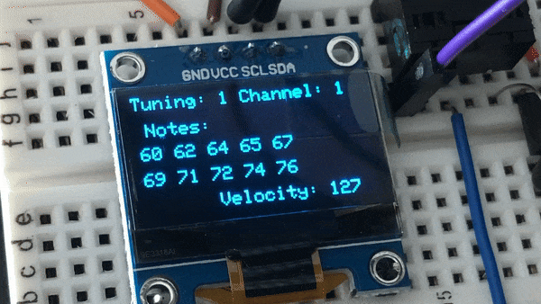
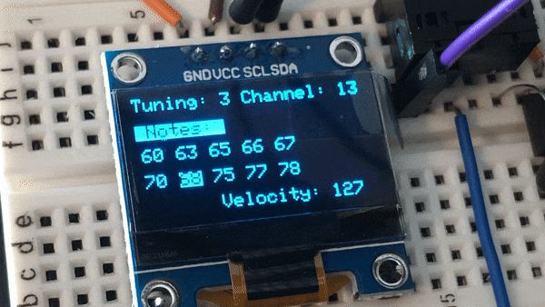
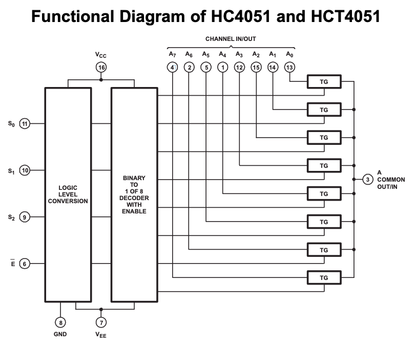

# Guitar Hero MIDI Controller

### In this project I use an Arduino Pro Micro to convert a Guitar Hero video game controller into a MIDI controller.

<br>

## Hardware 

- Guitar Hero controller (for MIDI hacking)
- Arduino Pro Micro ([ATmega32U4](https://cdn.sparkfun.com/datasheets/Dev/Arduino/Boards/ATMega32U4.pdf?_gl=1*20f3qw*_ga*NDA3MzU0MzI2LjE2OTU5OTc2MzA.*_ga_T369JS7J9N*MTcwMDE2NzA2OC4yMC4xLjE3MDAxNjcxNzAuNjAuMC4w))
- Single color [OLED SSD Screen](https://www.rajguruelectronics.com/Product/1147/OLED%204%20Pin%200.96%20inch%20128x64%20display%20module%20%20yellow%20bule.pdf) (4 pin)
- Buttons (from guitar hero controller)
- Multiplexer (MUX) modules (e.g., [CD74HC4051](https://www.ti.com/lit/ds/symlink/cd74hc4051.pdf?ts=1700162797267&ref_url=https%253A%252F%252Fwww.ti.com%252Fproduct%252FCD74HC4051))
- Potentiometers (from guitar hero controller)
- Capacitors for smoothing out the potentiometers
- TRS jack for MIDI output (from guitar hero controller) 
- Resistor for MIDI output 

## Software

- [Adafruit_SSD1306 library](https://github.com/adafruit/Adafruit_SSD1306) for display
- [arduino_midi_library](https://github.com/FortySevenEffects/arduino_midi_library/tree/dev) for MIDI functionality
- [EEPROM library](https://docs.arduino.cc/learn/built-in-libraries/eeprom) to persist data across power cycle
- [Custom Code](https://github.com/IntuitiveHarmony/guitarHeroHack/blob/master/buttonMux.ino) hacked together with 💜 by me

<br>

## Background

Upon seeing 2 old Guitar Hero controllers at the thrift store I decided to pick one up and turn it into a MIDI controller.  The goal was to build program to handle the various button presses available and turn them into meaningful MIDI data.  One of the more challenging aspects of this endeavor for me was figuring out a user interface that made sense musically, was easy to interact with and was fun to play while avoiding any heavy modifications to the body of the instrument. 




### Added Display 🤩

Since the fret board on this controller is limited to 10 buttons and a western musical octave is broken down into 12 steps I wanted to give the user the ability to define the notes each button on the on the fret board triggered.  I wanted the user to be able to define other parameters such as MIDI channel, note velocity, continuous controller (CC) and have the ability to store different tunings as well.  The only way that made sense for me to be able to provide this level of functionality and do so effectively was to introduce a display screen into the mix.







*Early testing of the display*


## Wiring Diagram
*This diagram pictures a 4052 IC but the actual circuit uses a 4051*


<br>

## Circuit Overview

### Question 💭

The Pro Micro only has 16 available input pins, so how do we get the information from all of the 22 buttons individually and still have room for the pots and the screen?  


*Pro Micro Pinout*


### Answer

A multiplexer.  



<br>

This integrated circuit (IC) allows input from multiple sources and essentially funnels it into one output.  I used CD74HC4051 multiplexers (MUX) in this build, each one allows for 8 inputs.  MUX can be stacked as well, so I used 3 of them giving me the ability to connect up to 24 buttons to 1 input pin on the Arduino.  There is still a cost when it comes to pins with a multiplexer, the signal pins and the enable pin.  The way a multiplexer works is kind of like how a trumpet gets many notes from only three valves, only more simply.  In the case of a CD74HC4051 it uses 3 signal pins in various combinations of HIGH and LOW to allow the signal from each of the 8 channels to individually flow through to the common.  We can then use code to cycle through each channel very quickly.  The last step is enabling and disabling each of the 3 multiplexers via the enable pin, allowing only one to pass the signal at a time.

This functionality is handled by the following two functions.  I relied on chatGPT to help with figuring out the logic for this.  I assure you, it wasn't as if I sat down and asked ol' Chad for some code and just I copy and pasted it.  It was a 6 hour+ back and forth of prompts and then me tweaking the generated code until I had tuned it to function the way I intended.  Here is the product of that session.


```c++
void buttonMux() {
  // Loop through all the button channels on the MUX
  for (uint8_t i = 0; i < 24; ++i) {
    // Enable the appropriate MUX
    enableMux(i < 8 ? 0 : (i < 16 ? 1 : 2));

    // Control the selector pins based on the binary representation of i (this all chatGPT 😂)
    // Checks the least significant bit (LSB) of the variable i. The & operator performs a bitwise AND operation
    digitalWrite(signal0, (i & 0x01) ? HIGH : LOW);
    digitalWrite(signal1, (i & 0x02) ? HIGH : LOW);
    digitalWrite(signal2, (i & 0x04) ? HIGH : LOW);

    // Read the value from the selected button
    uint8_t buttonValue = digitalRead(muxCommon);

    // Check for button press
    if (buttonValue == 0 && previousButtonState[i] == 0) {
      // Button is pressed
      previousButtonState[i] = 1;
      handleButtonPress(i);
    }
    // Check for button release
    else if (buttonValue > 0 && previousButtonState[i] == 1) {
      // Button is released
      previousButtonState[i] = 0;
      handleButtonRelease(i);
    }
  }
}

// Use the enable pin on the Multiplexer to turn on only the MUX we want to read
void enableMux(uint8_t mux) {
  switch (mux) {
    case 0:
      digitalWrite(enableMux0, LOW);
      digitalWrite(enableMux1, HIGH);
      digitalWrite(enableMux2, HIGH);
      break;
    case 1:
      digitalWrite(enableMux0, HIGH);
      digitalWrite(enableMux1, LOW);
      digitalWrite(enableMux2, HIGH);
      break;
    case 2:
      digitalWrite(enableMux0, HIGH);
      digitalWrite(enableMux1, HIGH);
      digitalWrite(enableMux2, LOW);
      break;
  }
}
```

<br>

## A word about MIDI

MIDI stands for Musical Instrument Digital Interface.  Ok, great, what does that even mean?  The short answer is that MIDI is a way that electronic instruments communicate with each other.  So a MIDI controller such as the one I am building doesn't produce or send audio information, it rather sends data.  A MIDI controller is just a real-time, data slinger.  One of the pieces of data MIDI is used to control is the note data.  This comes in the form of a pair of MIDI messages, a `note on` and a `note off` message. They look something like this.

```c++
MIDI.sendNoteOn(note, velocity, channel);
MIDI.sendNoteOff(note, velocity, channel);

```

 Each `note on` will be executed the moment a note key is pressed. The `note off` will be executed once the button is released. The note is a value 0-127 and each correlates with a musical note and is what ties the `note off` to the `note on`. (with me?) 

 Let's say a function transposes the note while it is being held.  Then something like below will more than likely happen causing the original note to play until it a `note off` is played for that note.  I call them `sticky notes` and they are pretty annoying. Especially when it is high pitched and I cannot make the right `note off` message happen 😵‍💫. 

 ```c++
MIDI.sendNoteOn(note, velocity, channel);   // Sticky note will play forever...
MIDI.sendNoteOff(newNote, velocity, channel);

```  

There are a few instances in the Guitar Hero Hack where there is the potential for this to happen and was indeed happening so many times during testing.  To help take care of this I implemented the `handleHeldNotesWhileTransposing` function.  It loops through any held notes, triggers their respective `note off`, updates the note by the chosen interval, and then plays the updated note or notes.  This make the instrument the sound of "tuning" it while scrolling through the available semitone and octave interval steps.

```c++
// Change note on the fly if it being held down, will take care of MIDI note off for any held notes and MIDI on for the updated note value
void handleHeldNotesWhileTransposing(byte semitones) {
  // Check if any notes are being held
  if (numHeldNotes > 0) {
    for (int i = 0; i < numHeldNotes; ++i) {
      uint8_t heldNote = heldNotes[i];
      handleButtonRelease(heldNote);  // Turn off held note
    }
    // This changes the entire array of notes
    if (displayStep == 0 && menuStep == 0) {  // check if on main screen
      for (int i = 0; i < 10; ++i) {          // loop through all notes
        tuningSelection[selection].changeNote(i, semitones);
      }
    }
    // Single Note change
    else if (menuStep == 2) {                                          // Edit single notes menu selection
      tuningSelection[selection].changeNote(selectedNote, semitones);  // update single note in array
    }
    // Play new notes
    for (int i = 0; i < numHeldNotes; ++i) {
      uint8_t heldNote = heldNotes[i];
      handleButtonPress(heldNote);
    }
  }
  // No held notes, simply update
  else if (numHeldNotes == 0) {
    // This targets changing the entire array at once
    if (displayStep == 0 && menuStep == 0) { // Main display screen
      tuningSelection[selection].transposeAllNotes(semitones);
    }
    // Single Note change
    else {
      tuningSelection[selection].changeNote(selectedNote, semitones);
    }
  }
}
```


## Contributors

- Jason Horst
- Inspiration from a handful of docs, projects and articles I'm currently looking for the links to.
- Chat GPT (tedious work, some logic)

## License

This project is licensed under the [MIT License](https://opensource.org/license/mit/).
