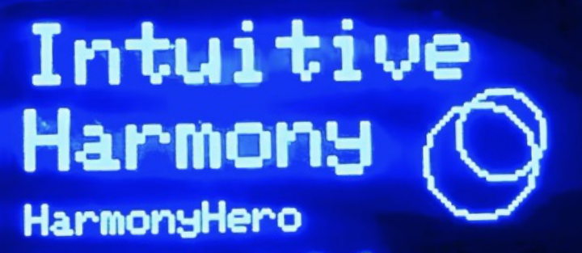
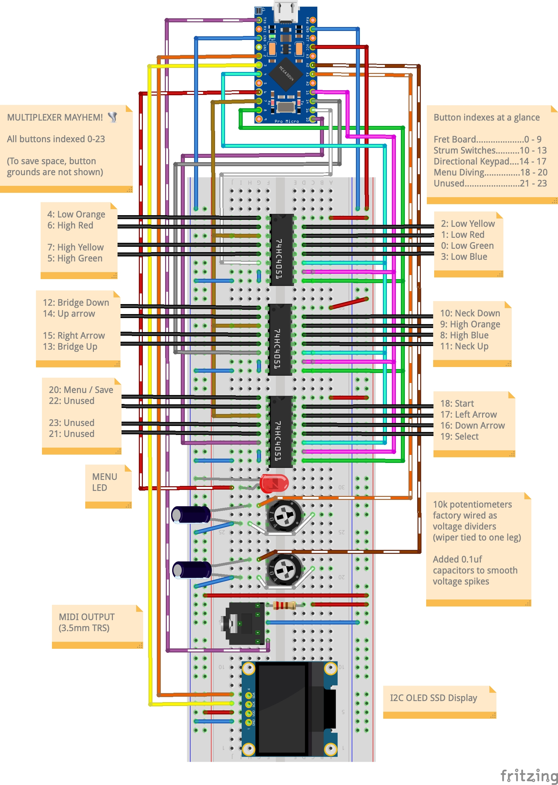
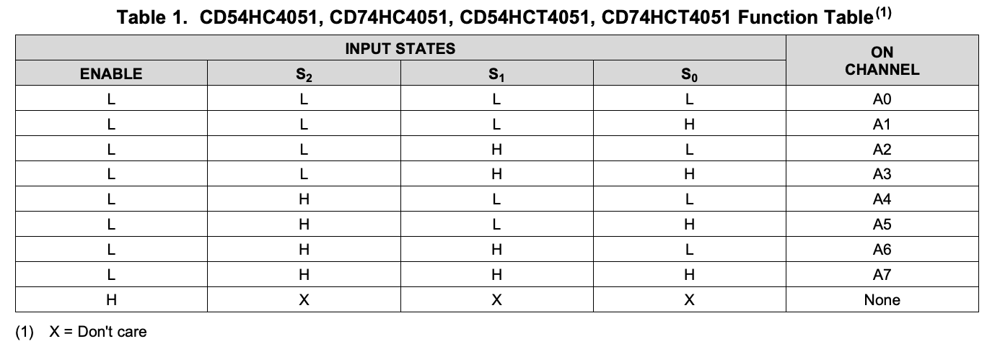
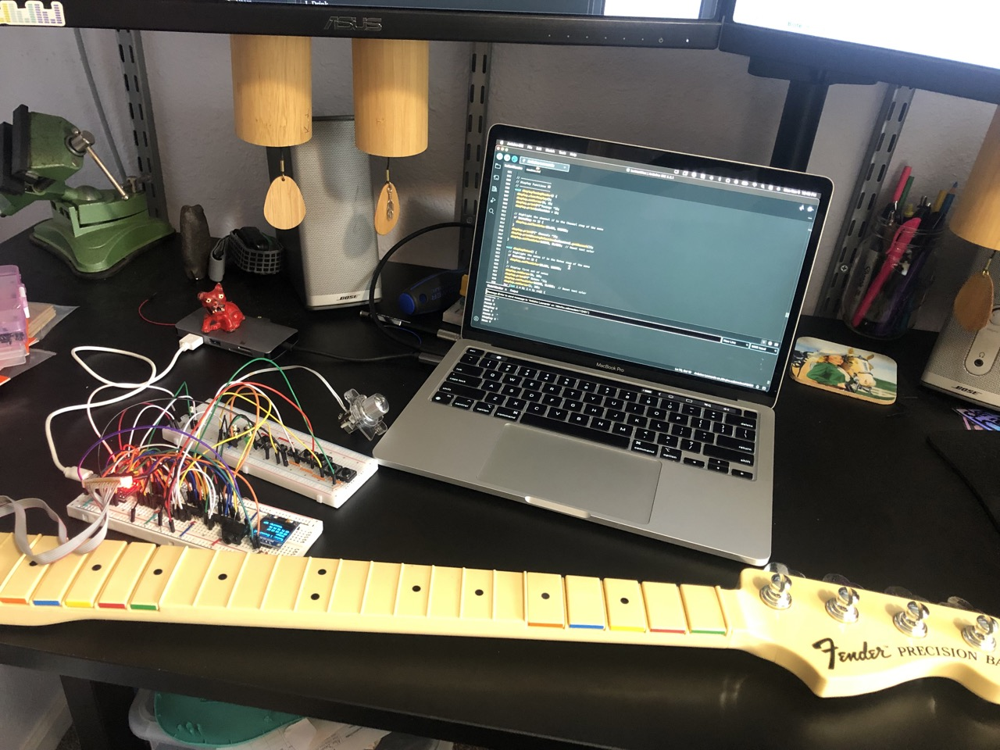
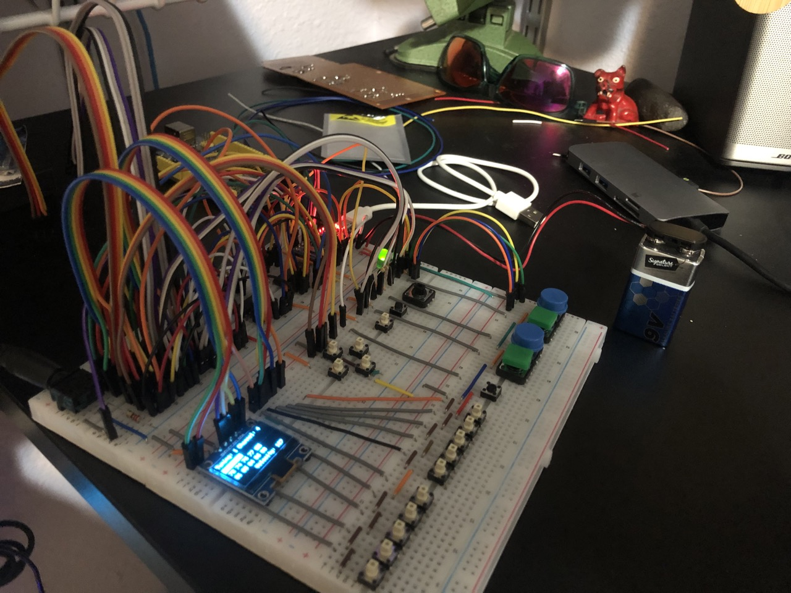

# HarmonyHero

### Utilizing an Arduino Pro Micro to convert a Guitar Hero video game controller into a MIDI controller.



<br>

🔗 MIDI is a serial protocol that allows electronic or computer based musical instruments to communicate with each other

✅ By completing this conversion the controller be able to control any MIDI enabled synthesizers you happen to have lying around

❌ After the conversion the controller will loose any functionality associated with the video game Guitar Hero

<br>

## Table of Contents

- [Hardware](#hardware)
  - [Original Components](#original-components)
  - [Added Components](#added-components)
- [Software](#software)
- [Version History](#version-history)
  - [1.0.0](#100)
    - [Features](#features)
    - [Known Issues](#known-issues)
- [Background](#background)
  - [Note Selection 🎶](#note-selection-)
  - [Added Display 🤩](#added-display-)
- [Wiring Diagram](#wiring-diagram)
- [Circuit Overview](#circuit-overview)
  - [🤔 I have a question](#-i-have-a-question)
  - [🤚 Multiplexer has an answer](#-multiplexer-has-an-answer)
- [Maxed Memory](#maxed-memory)
- [A word about MIDI](#a-word-about-midi)
- [Resources / Inspiration](#resources--inspiration)
- [Special Thanks](#special-thanks)
- [Contributors](#contributors)
- [License](#license)

## Hardware

### Original Components

_May vary based on brand/version of controller_

| Item                                                                                                             | Amount |
| ---------------------------------------------------------------------------------------------------------------- | ------ |
| Guitar Hero Controller (I used [Mad Catz Fender P-Bass](https://rockband.fandom.com/wiki/Fender_Precision_Bass)) | 1      |
| Fret Board Buttons                                                                                               | 10     |
| Strum Switch Buttons (2x buttons each switch)                                                                    | 4      |
| Directional Buttons                                                                                              | 4      |
| Menu Buttons                                                                                                     | 3      |
| 10k Potentiometers                                                                                               | 2      |
| 3.5mm TRS jack for [Type-A](https://minimidi.world/) MIDI output                                                 | 1      |

<br>

### Added Components

| Item                                                                                                                                                                                                            | Amount |
| --------------------------------------------------------------------------------------------------------------------------------------------------------------------------------------------------------------- | ------ |
| Arduino Pro Micro [ATmega32U4](https://cdn.sparkfun.com/datasheets/Dev/Arduino/Boards/ATMega32U4.pdf?_gl=1*20f3qw*_ga*NDA3MzU0MzI2LjE2OTU5OTc2MzA.*_ga_T369JS7J9N*MTcwMDE2NzA2OC4yMC4xLjE3MDAxNjcxNzAuNjAuMC4w) | 1      |
| Single color [OLED SSD Screen](https://www.rajguruelectronics.com/Product/1147/OLED%204%20Pin%200.96%20inch%20128x64%20display%20module%20%20yellow%20bule.pdf) 128x64 (4 pin)                                  | 1      |
| [CD74HC4051](https://www.ti.com/lit/ds/symlink/cd74hc4051.pdf?ts=1700162797267&ref_url=https%253A%252F%252Fwww.ti.com%252Fproduct%252FCD74HC4051) Multiplexer (MUX) module                                      | 3      |
| 0.1 uf Capacitors for smoothing out the potentiometers                                                                                                                                                          | 2      |
| 220 ohm Resistor for MIDI output                                                                                                                                                                                | 1      |

<br>

## Software

- [Adafruit_SSD1306 library](https://github.com/adafruit/Adafruit_SSD1306) for display
- [arduino_midi_library](https://github.com/FortySevenEffects/arduino_midi_library/tree/dev) for MIDI functionality
- [EEPROM library](https://docs.arduino.cc/learn/built-in-libraries/eeprom) to persist data across power cycle
- [Custom Code](https://github.com/IntuitiveHarmony/HarmonyHero/blob/master/HarmonyHero.ino) hacked together with 💜 by me

<br>

## Version History

### 1.0.0

Date: 12/7/23

#### Features

- Controls synthesizers and other MIDI instruments
- Added OLED screen to display parameters
- Allows the saving and recalling of five distinct 10-note user-defined tunings
- Permits customization of the MIDI channel and velocity for each tuning
- Four user-defined CC toggles per tuning controlled by the strum switches
- Transposition of tuning up/down an octave or semitone with directional button touch

#### Known Issues

- The function `handleHeldNotesWhileTransposing()` will leave sticky notes if a held note is released while the notes are transposed with the directional keys
- Any held notes will become stuck when switching tunings to another. especially if to another channel
- Whammy bar does not reset when released to neutral position

<br>

## Background

Upon seeing 2 old Guitar Hero controllers at the thrift store I decided to pick one up and turn it into a MIDI controller. The goal was to build program to handle the various button presses available and turn them into meaningful MIDI data. One of the more challenging aspects of this endeavor for me was figuring out a user interface that made sense musically, was easy to interact with and was fun to play while avoiding any heavy modifications to the body of the instrument.


### Note Selection 🎶

Given the 10-button limit on this controller's fret board, I was originally thinking of tuning it to a distinctive 5-note scale, perhaps the minor pentatonic scale. Tuning instruments diatonically (limited to notes within one key) is concept is akin to what you find in certain instruments like tank drums, some glockenspiels, percussion blocks. Sometimes I feel like diatonic tunings can be limiting.

However, I think inspiration can stem from limitations, so my aim was to offer users maximum flexibility while still embracing the constraints of the 10-button fret board. Instead of restricting the user to a predefined scale provided by me, I included the flexibility for the user to change each of the 10 notes on the fret board to one of their choice, thus allowing for custom 10 note scales to be input by the user.

### Added Display 🤩

I also wanted the user to be able to define other parameters such as MIDI channel, note velocity, continuous controller (CC) and have the ability to store and recall different tunings as well. The only way that made sense for me to be able to provide this level of functionality and do so effectively was to introduce a display screen into the mix. Later I will cut a small hole in the body of the guitar in order to make it visible in the final build.


_Early testing of the display_

## Wiring Diagram



<br>

## Circuit Overview

### 🤔 I have a question

The Pro Micro only has 16 available input pins, so how do we get the information from all of the 22 buttons individually and still have room for the potentiometers and the screen?


_Pro Micro Pinout_

### 🤚 Multiplexer has an answer

The multiplexer takes input from multiple sources and essentially funnels it into one output, allowing the signal to pass through each channel one at a time. I used CD74HC4051 multiplexers (MUX) in this build, each one allows for 8 inputs. Multiplexers can be stacked as well, so I used 3, giving me the ability, in this case, to connect up to 24 buttons to 1 input pin on the Arduino.


<br>

There is still a cost when it comes to pins with a multiplexer, the signal pins and the enable pin. Once the dust settles I can connect up to 24 individual buttons to only 7 pins on the Arduino.

- 1 common pin (Where the buttons are funneled to)
- 3 signal pins (To control which button is connected to common)
- 3 enable pins (To turn each individual MUX on or off completely)

The way a multiplexer works is kind of like how a trumpet gets many notes from only three valves, only more simply. In the case of a CD74HC4051 it uses 3 signal pins in various combinations of HIGH and LOW to allow the signal from each of the 8 channels to individually flow through to the common. The next step is enabling and disabling each of the 3 multiplexers via the enable pin, allowing only one to pass the signal at a time. The following truth table from the [data sheet](https://www.ti.com/lit/ds/symlink/cd74hc4051.pdf?ts=1700162797267&ref_url=https%253A%252F%252Fwww.ti.com%252Fproduct%252FCD74HC4051) helps by breaking down all the possible combinations of the signal and enable pin of a single MUX. We can then use code to cycle through each channel and MUX individually and very quickly.

<br>



<br>

This rapid switching through each channel is handled by the following two functions. I relied on chatGPT to help with figuring out the logic for this. This consisted of a 6 hour+ back and forth of prompts and then me tweaking the generated code until I had tuned it to perform the way I intended.

<details>
<summary>Open if you enjoy looking at code</summary>

```c++
void buttonMux() {
  // Loop through all the button channels on the MUX
  for (uint8_t i = 0; i < 24; ++i) {
    // Enable the appropriate MUX
    enableMux(i < 8 ? 0 : (i < 16 ? 1 : 2));

    // Control the selector pins based on the binary representation of i (this all chatGPT 😂)
    // Checks the least significant bit (LSB) of the variable i. The & operator performs a bitwise AND operation
    digitalWrite(signal0, (i & 0x01) ? HIGH : LOW);
    digitalWrite(signal1, (i & 0x02) ? HIGH : LOW);
    digitalWrite(signal2, (i & 0x04) ? HIGH : LOW);

    // Read the value from the selected button
    uint8_t buttonValue = digitalRead(muxCommon);

    // Check for button press
    if (buttonValue == 0 && previousButtonState[i] == 0) {
      // Button is pressed
      previousButtonState[i] = 1;
      handleButtonPress(i);
    }
    // Check for button release
    else if (buttonValue > 0 && previousButtonState[i] == 1) {
      // Button is released
      previousButtonState[i] = 0;
      handleButtonRelease(i);
    }
  }
}

// Use the enable pin on the Multiplexer to turn on only the MUX we want to read
void enableMux(uint8_t mux) {
  switch (mux) {
    case 0:
      digitalWrite(enableMux0, LOW);
      digitalWrite(enableMux1, HIGH);
      digitalWrite(enableMux2, HIGH);
      break;
    case 1:
      digitalWrite(enableMux0, HIGH);
      digitalWrite(enableMux1, LOW);
      digitalWrite(enableMux2, HIGH);
      break;
    case 2:
      digitalWrite(enableMux0, HIGH);
      digitalWrite(enableMux1, HIGH);
      digitalWrite(enableMux2, LOW);
      break;
  }
}
```

</details>

<br>

## Maxed Memory

The program memory for this instrument is around 88%. Running a program that takes up this much space can sometimes cause issues. When I was testing an early version of the controller I was facing an issue where the program would freeze, but only when running on 9v battery power. I was about ready to transfer the code over to an Arduino Mega to try and resolve the issue by using something with more memory. Before I did I rebuilt the test circuit in order to make the transfer to the new board a bit easier.

To my amazement, the program worked perfectly on 9v power while using the original board. I never even tried the Mega. This was a reminder to myself that sometimes starting afresh can resolve challenges.



_Original test circuit_

<br>



_Rebuilt test circuit_

<br>

## A word about MIDI

MIDI stands for Musical Instrument Digital Interface. Ok, great, what does that even mean? The short answer is that MIDI is a way that electronic instruments communicate with each other. So a MIDI controller such as the one I am building doesn't produce or send audio information, it rather sends data. A MIDI controller is just a real-time, data slinger. One of the pieces of data MIDI is used to control is the note data. This comes in the form of a pair of MIDI messages, a `note on` and a `note off` message. They look something like this.

```c++
MIDI.sendNoteOn(note, velocity, channel);
MIDI.sendNoteOff(note, velocity, channel);

```

Each `note on` will be executed the moment a note key is pressed. The `note off` will be executed once the button is released. The note is a value 0-127 and each correlates with a musical note and is what ties the `note off` to the `note on`. (still with me?)

Let's say a function transposes the note while it is being held. Then something like below will more than likely happen causing the original note to play until it a `note off` is played for that note. I call them `sticky notes` and they are pretty annoying. Especially when it is high pitched and I cannot make the right `note off` message happen 😵‍💫.

```c++
MIDI.sendNoteOn(note, velocity, channel);   // Sticky note will play forever...
MIDI.sendNoteOff(newNote, velocity, channel);

```

There are a few instances in the HarmonyHero where there is the potential for this to happen and was indeed happening so many times during testing. To help take care of this I implemented the `handleHeldNotesWhileTransposing` function. It loops through any held notes, triggers their respective `note off`, updates the note by the chosen interval, and then plays the updated note or notes. This make the instrument the sound of "tuning" it while scrolling through the available semitone and octave interval steps.

<details>
<summary>This my favorite function of the project, because of the sound it produces when notes are held and transposed at the same time</summary>

```c++
// Change note on the fly if it being held down, will take care of MIDI note off for any held notes and MIDI on for the updated note value
void handleHeldNotesWhileTransposing(byte semitones) {
  // Check if any notes are being held
  if (numHeldNotes > 0) {
    for (int i = 0; i < numHeldNotes; ++i) {
      uint8_t heldNote = heldNotes[i];
      handleButtonRelease(heldNote);  // Turn off held note
    }
    // This changes the entire array of notes
    if (displayStep == 0 && menuStep == 0) {  // check if on main screen
      for (int i = 0; i < 10; ++i) {          // loop through all notes
        tuningSelection[selection].changeNote(i, semitones);
      }
    }
    // Single Note change
    else if (menuStep == 2) { // Edit single notes menu selection
      tuningSelection[selection].changeNote(selectedNote, semitones);  // update single note in array
    }
    // Play new notes
    for (int i = 0; i < numHeldNotes; ++i) {
      uint8_t heldNote = heldNotes[i];
      handleButtonPress(heldNote);
    }
  }
  // No held notes, simply update
  else if (numHeldNotes == 0) {
    // This targets changing the entire array at once
    if (displayStep == 0 && menuStep == 0) { // Main display screen
      tuningSelection[selection].transposeAllNotes(semitones);
    }
    // Single Note change
    else {
      tuningSelection[selection].changeNote(selectedNote, semitones);
    }
  }
}
```

</details>

<br>

## Resources / Inspiration

- **Notes and Volts**, [MIDI for the Arduino - Circuit Analysis](https://www.youtube.com/watch?v=0L7WAMFWSgY&list=PL4_gPbvyebyH2xfPXePHtx8gK5zPBrVkg&ab_channel=NotesandVolts)
- **Gustavo Silveira**, [musiconerd.com](https://www.musiconerd.com/)
- **Conrad Menchine**, [Guitar Hero MIDI Controller](https://www.youtube.com/watch?v=obNs_aYCkjY&ab_channel=ConradMenchine)
- **minimidi.world**, [A simplified guide to TRS MIDI](https://minimidi.world/)

<br>

## Special Thanks

- **Z** - I'm grateful for your expertise during our debugging sessions. The lessons I learned from you have been invaluable to me while navigating the challenges presented by this project.

## Contributors

- Jason Horst
- Chat GPT (tedious work, some logic)

## License

This project is licensed under the [MIT License](https://opensource.org/license/mit/).

If you see a way to improve this code, please submit a pull request 😎
